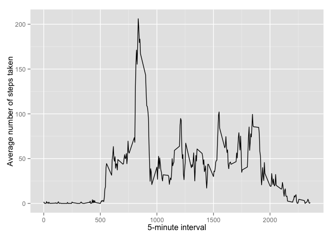
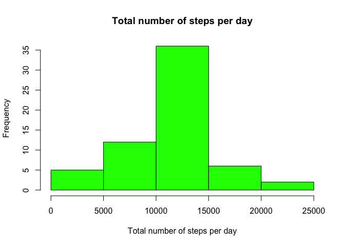
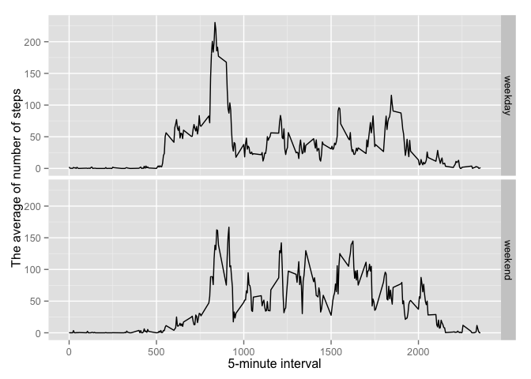

# Reproducible Research: Peer Assessment 1


## Loading and preprocessing the data

Unzip and load the csv file


```r
unzip(zipfile="activity.zip")
act_data <- read.csv("activity.csv")
```


## What is mean total number of steps taken per day?
Load needed libraries

```r
# library(ggplot2)
```

Make a histogram of the total number of steps taken each day

```r
totnum.steps <- tapply(act_data$steps, act_data$date, FUN=sum, na.rm=TRUE)
# qplot(totnum.steps, binwidth=1000, xlab="Total number of steps taken each day")
hist(totnum.steps,main='Total number of steps per day',xlab='Total number of steps per day',col='blue')
```

 

Calculate and report the mean and median of the total number of steps taken per day

```r
mean(totnum.steps, na.rm=TRUE)
```

```
## [1] 9354.23
```

```r
median(totnum.steps, na.rm=TRUE)
```

```
## [1] 10395
```


## What is the average daily activity pattern?
Load needed libraries

```r
library(ggplot2)
```

```
## Warning: package 'ggplot2' was built under R version 3.1.3
```

Time series plot

```r
average <- aggregate(x=list(steps=act_data$steps), by=list(interval=act_data$interval),
                      FUN=mean, na.rm=TRUE)
ggplot(data=average, aes(x=interval, y=steps)) +
    geom_line() +
    xlab("5-minute interval") +
    ylab("Average number of steps taken")
```

 


Which 5-minute interval, on average across all the days in the dataset, contains the maximum number of steps?

```r
average[which.max(average$steps),]
```

```
##     interval    steps
## 104      835 206.1698
```


## Imputing missing values

There are many days/intervals where there are missing values (coded as NA). The presence of missing days may introduce bias into some calculations or summaries of the data.

Total number of missing values

```r
missing <- is.na(act_data$steps)
table(missing)
```

```
## missing
## FALSE  TRUE 
## 15264  2304
```

All of the missing values are filled in with mean value for that 5-minute interval.

```r
fill.value <- function(steps, interval) {
    filled <- NA
    if (!is.na(steps))
        filled <- c(steps)
    else
        filled <- (average[average$interval==interval, "steps"])
    return(filled)
}
filled.data <- act_data
filled.data$steps <- mapply(fill.value, filled.data$steps, filled.data$interval)
```


Make a histogram of the total number of steps,usig latest filled.data taken each day and calculate and report the mean and median total number of steps taken per day

```r
total.steps <- tapply(filled.data$steps, filled.data$date, FUN=sum)
hist(total.steps ,main='Total number of steps per day',xlab='Total number of steps per day',col='green')
```

 

```r
# qplot(total.steps, binwidth=1000, xlab="total number of steps taken each day")
mean(total.steps)
```

```
## [1] 10766.19
```

```r
median(total.steps)
```

```
## [1] 10766.19
```


Mean and median values are higher after imputing missing data.
Reson being that data, where some days with steps values NA for any interval have been replaced with the mean steps of associated interval value.
These 0 values (NA values) are now removed from the histogram of total number of steps taken each day.

## Are there differences in activity patterns between weekdays and weekends?

Create a new factor variable in the dataset with two levels – “weekday” and “weekend” indicating whether a given date is a weekday or weekend day.

```r
weekday.or.weekend <- function(date) {
    day <- weekdays(date)
    if (day %in% c("Monday", "Tuesday", "Wednesday", "Thursday", "Friday"))
        return("weekday")
    else if (day %in% c("Saturday", "Sunday"))
        return("weekend")
    else
        stop("invalid date")
}
filled.data$date <- as.Date(filled.data$date)
filled.data$day <- sapply(filled.data$date, FUN=weekday.or.weekend)
```


Make a panel plot containing a time series plot (i.e. type = "l") of the 5-minute interval (x-axis) and the average number of steps taken, averaged across all weekday days or weekend days (y-axis).

```r
average <- aggregate(steps ~ interval + day, data=filled.data, mean)
ggplot(average, aes(interval, steps)) + geom_line() + facet_grid(day ~ .) +
    xlab("5-minute interval") + ylab("The average of number of steps")
```

 
